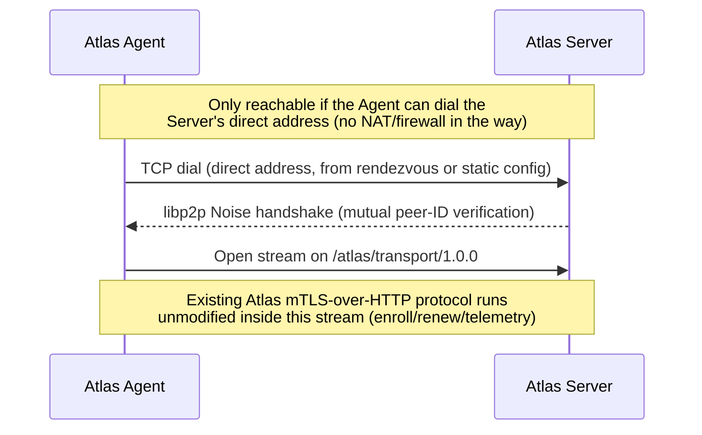
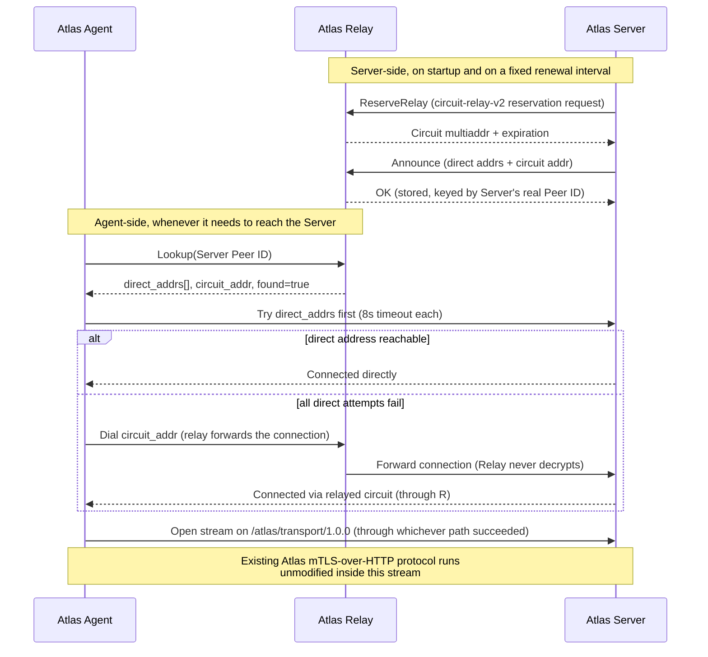

# Atlas Relay

Operational documentation for `atlas-relay`, the circuit-relay-v2 + rendezvous bootstrap component that lets an Atlas Agent and Atlas Server find and reach each other by cryptographic identity (libp2p Peer ID) instead of by network address.

This document is derived directly from the source in `internal/relay/`, `cmd/atlas-relay/`, `internal/core/transport/libp2ptransport/libp2ptransport.go`, `internal/app/fleet.go` (Server-side relay usage), and `internal/agent/discovery.go` (Agent-side relay usage). Anything that could not be confirmed from the repository is explicitly marked **Not confirmed** or **TODO**.

---

## 1. Relay Overview

**What it is:** a minimal, standalone libp2p host (`internal/relay/relay.go`) running exactly two capabilities: the standard **circuit-relay-v2** protocol (forwards encrypted streams between two peers, unmodified go-libp2p behavior) and a small **rendezvous** protocol Atlas defines itself (`/atlas/rendezvous/announce/1.0.0` and `/atlas/rendezvous/lookup/1.0.0`) that lets a Server publish its currently-reachable addresses and an Agent look them up by Peer ID.

**Why it exists:** per `docs/adr/0012-connect-by-identity.md`, an Atlas Server may run somewhere with no stable, dialable address — behind NAT, on a laptop, with no forwarded port, and deliberately with no dependency on a third-party tunnel/overlay (Cloudflare Tunnel, Tailscale were explicitly rejected as alternatives). The Relay is the self-hosted replacement: it lets two identified libp2p peers (Server and Agent) get into a connected state without either needing a fixed address the other can dial directly.

**When it is required:** only when at least one Agent↔Server relationship uses `transport=libp2p` **and** either side is not directly reachable. It plays no role at all for the default `https` transport.

**What problem it solves:** two problems, together —
1. **NAT traversal / reachability** (circuit-relay-v2: forward bytes for a peer that has no reachable direct address).
2. **Discovery** (rendezvous: an Agent that knows only the Server's Peer ID — not its current address — can still find it, without an operator hand-assembling and distributing a fresh multiaddr every time the Server's address changes).

**Explicitly out of scope, by design:** the Relay carries **no Atlas business logic**. No Postgres, no HTTP API, no mTLS termination (`cmd/atlas-relay/main.go:1-7`). It forwards and stores address records; it never authenticates an Atlas identity, never decrypts application traffic, and never sees anything Atlas actually collects.

---

## 2. Relay Working Model

Traced from `cmd/atlas-relay/main.go` → `internal/relay/relay.go` (`New`, `Run`).

```text
atlas-relay process starts (cmd/atlas-relay/main.go)
        │
        ▼
Load Config from ATLAS_RELAY_* env vars (relay.LoadConfig)
        │
        ▼
Load or generate this Relay's persistent libp2p identity
   (<data-dir>/p2p-identity.key — same mechanism the Agent and
    Server use, internal/core/transport/libp2ptransport.go:53-86)
        │
        ▼
Build the libp2p host (internal/relay/relay.go:22-30):
   - Bind ATLAS_RELAY_LISTEN_ADDRS (default /ip4/0.0.0.0/tcp/4103)
   - ForceReachabilityPublic (skip AutoNAT's cross-confirmation probe —
     the operator running this as a relay already knows it's reachable)
   - EnableRelayService with infinite per-connection limits
     (the small-topology default of 2min/128KB is sized for NAT-punch
     bootstrapping, not a kept-alive HTTP-over-libp2p connection)
        │
        ▼
Register rendezvous stream handlers on the same host
   (Announce + Lookup — internal/core/transport/libp2ptransport.go:371-402)
        │
        ▼
Log this Relay's Peer ID and dialable multiaddrs
        │
        ▼
Block until SIGINT/SIGTERM
        │
        ▼
Meanwhile, asynchronously, driven entirely by the OTHER two components:
   ├─ Atlas Server (if ATLAS_FLEET_LIBP2P_RELAY_ADDR is set) periodically
   │    reserves a circuit-relay slot and Announces its addresses here
   └─ Atlas Agent (if using rendezvous discovery) periodically Looks Up
        the Server's Peer ID here, then dials it — directly if possible,
        else through this Relay's forwarded circuit
        │
        ▼
Ctrl-C / SIGTERM → host.Close()
```

The Relay itself never initiates anything — it is purely reactive to Announce/Lookup/circuit-reserve/circuit-dial requests from the Server and Agent.

---

## 3. Relay Connectivity Model

```text
                 +------------------+
                 |  Atlas Server    |
                 |  (dials OUT)     |
                 +--------+---------+
                          │
                          │  1. ReserveRelay  (circuit-relay-v2 reservation)
                          │  2. Announce      (rendezvous: publish addresses)
                          ▼
                 +------------------+
                 |   Atlas Relay    |
                 |  circuit-relay-v2 |
                 |  + rendezvous     |
                 |  registry (RAM)   |
                 +--------+---------+
                          ▲
                          │  3. Lookup        (rendezvous: ask for Server's addrs)
                          │  4. Dial candidates (direct-first, then this Relay's
                          │     forwarded circuit, as a last resort)
                          │
                 +--------+---------+
                 |   Atlas Agent    |
                 |  (dials OUT)     |
                 +------------------+
```

**Both the Server and the Agent connect to the Relay by dialing out to it.** Neither ever needs to accept an inbound connection from the Relay. Only the Relay itself needs an inbound-reachable listen address — it is the one component in this topology that must be publicly dialable.

### Rendezvous and circuit-relay are separate concerns

- **Rendezvous** (`Announce`/`Lookup`) is pure address-book bookkeeping: "here is where I can currently be reached" / "where can peer X currently be reached." It does not move any Atlas application traffic.
- **circuit-relay-v2** is the actual traffic-forwarding mechanism, used only as the last-resort dial candidate, when none of the Server's direct addresses were reachable.

A Server with a genuinely reachable direct address only needs the Relay for rendezvous (so the Agent can find that address at all); a Server fully behind NAT needs the Relay for both.

---

## 4. Relay vs Direct Connectivity

### Preferred (by the Agent's dial-candidate ordering)

```text
Server ←──────────────────────────→ Agent
              Direct dial
   (only if the Server announced a reachable
    direct address, and it is actually reachable
    from where the Agent runs)
```

**Status: supported by the code (`internal/agent/discovery.go:55-73` tries direct addresses first), not confirmed as currently proven in this repository's verified deployment.** Whether it actually succeeds depends entirely on network topology outside this codebase (NAT, firewall rules, published ports) — do not represent it as tested.

### Fallback (the currently verified path)

```text
Server ←────→ Atlas Relay ←────→ Agent
        circuit-relay-v2 forwarded stream
```

This is the path this repository's own comments describe as proven: `docker-compose.prod.yml`'s Server-service comment states *"The verified working Mac→Relay→Agent path already proved this — no port was forwarded for it either."* Treat this — Agent → Rendezvous Discovery → Relay → Server — as the current, demonstrated connectivity model. The direct path exists in the code as the preferred first attempt, not as a separately proven deployment mode.

---

## 5. Relay Responsibilities

| Responsibility | Confirmed | Source |
|---|---|---|
| libp2p host / persistent Peer ID | ✅ | `relay.go:22-30`, `libp2ptransport.go:53-86` |
| circuit-relay-v2 service (forward encrypted streams) | ✅ | `libp2ptransport.go:203-229`, `NewRelayHost` |
| Rendezvous registry: Announce (register addresses) | ✅ | `libp2ptransport.go:275-308`, `374-383` |
| Rendezvous registry: Lookup (resolve a Peer ID's addresses) | ✅ | `libp2ptransport.go:310-335`, `384-401` |
| Connection forwarding for reserved peers | ✅ (standard go-libp2p circuit-relay-v2 behavior) | `libp2p.EnableRelayService`, `relayv2.WithInfiniteLimits()` |
| Peer authentication of Atlas identities | ❌ Explicitly not implemented — see [§14](#14-security) | ADR-0012, `internal/relay/relay.go` package doc |
| Logging | ✅ (minimal) | `relay.go:45-51`: one line at startup (Peer ID + addrs), nothing else structured found |
| Metrics/telemetry endpoint | ❌ Not confirmed / not found | No `/metrics`, no HTTP server, no health endpoint anywhere in `internal/relay` or `cmd/atlas-relay` |
| Lifecycle (graceful shutdown) | ✅ | `relay.go:45-51`, blocks on `ctx.Done()`, then `host.Close()` |
| Resource management (per-connection limits) | ✅ — deliberately **disabled** (infinite limits) | `libp2ptransport.go:198-202` |
| Persistent state | ❌ By design — rendezvous registry is in-memory only | `libp2ptransport.go:337-341` |

---

## 6. Relay Configuration

Complete list — source: `internal/relay/config.go`.

| Variable | Required | Example | Description |
|---|---|---|---|
| `ATLAS_RELAY_DATA_DIR` | No (default `/var/lib/atlas-relay`) | `/var/lib/atlas-relay` | Where the Relay's persistent Peer ID keypair (`p2p-identity.key`) is stored |
| `ATLAS_RELAY_LISTEN_ADDRS` | No (default `/ip4/0.0.0.0/tcp/4103`) | `/ip4/0.0.0.0/tcp/4103` | Comma-separated multiaddrs to listen on. Must be at least one — `NewRelayHost` errors on an empty list (`libp2ptransport.go:205-207`) |
| `ATLAS_RELAY_LOG_LEVEL` | No (default `info`) | `debug` | `info` or `debug` |

No other Relay-specific configuration exists. There is no authentication/token config, no allowlist config, no rate-limit config, no metrics-port config.

---

## 7. Relay Ports and Network Requirements

```text
Inbound:
  TCP <ATLAS_RELAY_LISTEN_ADDRS port>  (default 4103) — from any Server or
  Agent that needs to reach this Relay. Must be reachable from wherever
  Atlas Servers and Agents run — typically the public internet, since the
  Relay's entire purpose is to be reachable when the Server/Agent are not.

Outbound:
  None required initiated by the Relay itself — it never dials anywhere
  first; every connection to it is inbound (Server/Agent dial out to it).
```

| Transport | Used | Notes |
|---|---|---|
| TCP | ✅ Confirmed | The only transport explicitly configured (`ATLAS_RELAY_LISTEN_ADDRS` default and every example multiaddr in this repository use `/tcp/`) |
| UDP | Not confirmed | No UDP multiaddr appears anywhere in configuration or code |
| QUIC | **Implementation-dependent, not confirmed** | `libp2p.New` is called with only `libp2p.Identity`, `libp2p.ListenAddrStrings`, `libp2p.ForceReachabilityPublic`, and `libp2p.EnableRelayService` (`libp2ptransport.go:214-224`) — no explicit `libp2p.Transport(...)` restriction is set, so go-libp2p's own default transport set applies. Whether that default set includes QUIC depends on the go-libp2p version pinned in `go.mod` and is not verified here. Atlas's own configuration and code only ever reference TCP multiaddrs. |
| WebSocket / WebTransport | **Implementation-dependent, not confirmed** | Same reasoning as QUIC above — no explicit opt-in or opt-out found; Atlas's documented/used addresses are TCP-only |

**Firewall requirement, concretely:** open inbound TCP on the Relay's listen port (default `4103`) from wherever Servers and Agents will connect. No other port is required by anything documented in this repository.

---

## 8. Multiaddresses

The Relay's dialable address, as logged at startup (`relay.go:45-48`, using `libp2ptransport.Addrs`) and as it appears throughout this repository's configuration examples, is:

```text
/ip4/<RELAY_IP>/tcp/<RELAY_PORT>/p2p/<RELAY_PEER_ID>
```

- **IP:** the publicly reachable address of the host running the Relay.
- **Protocol:** TCP (confirmed; see [§7](#7-relay-ports-and-network-requirements) for the QUIC/WebSocket caveat).
- **Port:** `ATLAS_RELAY_LISTEN_ADDRS`'s port, default `4103`.
- **Peer ID:** the Relay's own persistent identity, printed at every startup and stable across restarts as long as `ATLAS_RELAY_DATA_DIR` is preserved.

**How the Agent uses it:** set as `ATLAS_AGENT_LIBP2P_RELAY_ADDR` (or `ATLAS_AGENT_RELATIONSHIP_<ID>_LIBP2P_RELAY_ADDR`) — the same value for every Agent in a fleet. Used to open rendezvous Lookup streams and, if needed, dial a circuit through this Relay.

**How the Server uses it:** set as `ATLAS_FLEET_LIBP2P_RELAY_ADDR` — used to reserve a circuit-relay slot and to Announce the Server's addresses.

**A second multiaddr form** appears once a Server has reserved a circuit — the address other peers dial to reach it *through* this Relay:

```text
/ip4/<RELAY_IP>/tcp/<RELAY_PORT>/p2p/<RELAY_PEER_ID>/p2p-circuit/p2p/<SERVER_PEER_ID>
```

(`internal/core/transport/libp2ptransport.go:437-450`, `ReserveRelay`.) This is what the deprecated static-multiaddr Agent mode (`ATLAS_AGENT_LIBP2P_SERVER_ADDR`) would need hand-assembled; rendezvous discovery produces and uses it automatically instead.

---

## 9. Rendezvous / Discovery

Source: `internal/core/transport/libp2ptransport.go:231-402`.

- **No namespace concept exists.** The registry is a flat `map[peer.ID]registryRecord` (`libp2ptransport.go:342-351`) — one record per Peer ID, globally, with no grouping/namespacing/fleet-scoping at the Relay layer.
- **Registration (`Announce`):** a peer opens `/atlas/rendezvous/announce/1.0.0`, sends its current direct addresses and (if it has one) its circuit address. The registry key is **the stream's real, cryptographically-verified remote Peer ID** — never anything the request body claims (`libp2ptransport.go:275-281`) — so one peer cannot overwrite another's record by lying about its identity.
- **Discovery (`Lookup`):** a peer opens `/atlas/rendezvous/lookup/1.0.0`, sends a target Peer ID (as a string), gets back that peer's last-announced direct/circuit addresses and a `Found` boolean.
- **TTL/expiry:** **none found.** A record is overwritten on the next Announce and simply lost entirely on Relay restart (in-memory only — `libp2ptransport.go:337-341`); there is no explicit expiry timer or staleness check on read. A stale-but-not-yet-overwritten record could in principle be returned indefinitely if the announcing peer stopped announcing without the Relay restarting — **not confirmed to be mitigated anywhere in this code.**
- **How the Server finds/uses the Relay:** configured directly via `ATLAS_FLEET_LIBP2P_RELAY_ADDR`; not itself "discovered" — the operator hands the Server the Relay's address (`internal/app/fleet.go:181-191`).
- **How the Agent finds/uses the Relay:** same — configured directly via `ATLAS_AGENT_LIBP2P_RELAY_ADDR`; not dynamically discovered.
- **What happens when discovery fails:** see [AGENT_README.md §14](AGENT_README.md#14-reconnection-and-failure-handling) for the Agent's cache-then-fresh-retry behavior. From the Relay's side, a failed Lookup simply returns `Found: false` or the stream fails to open — the Relay does not retry or notify anyone.

---

## 10. Deployment

**Confirmed:** `atlas-relay` is a plain Go binary (`cmd/atlas-relay`), built with `go build ./cmd/atlas-relay`, matching the "native binary managed by systemd" pattern the Agent also uses.

**Not confirmed / TODO — no packaging exists in this repository for the Relay:**
- No `packaging/atlas-relay/` directory (contrast with `packaging/atlas-agent/`, which ships `install.sh`, `uninstall.sh`, and a systemd unit).
- No systemd unit file for `atlas-relay` anywhere in the repository.
- No Dockerfile builds an `atlas-relay` image — the repository's only `Dockerfile` builds `atlas-server` exclusively.

**Practical deployment (unofficial, not shipped by this repo — construct your own):**

```bash
go build -o atlas-relay ./cmd/atlas-relay

sudo install -o root -g root -m 0755 atlas-relay /usr/local/bin/atlas-relay
sudo mkdir -p /var/lib/atlas-relay
# TODO: no reference systemd unit exists — the Agent's atlas-agent.service
# (packaging/atlas-agent/atlas-agent.service) is a reasonable structural
# template (Restart=always, StateDirectory, hardening flags), but it must be
# adapted by hand: different binary path, different env vars
# (ATLAS_RELAY_* instead of ATLAS_AGENT_*), and no /etc/atlas-agent-style
# EnvironmentFile convention has been established for the Relay in this repo.
```

Directory/permission conventions below are inferred from the Agent's established pattern for consistency, **not** verified against any Relay-specific script:

| Item | Suggested value | Verified? |
|---|---|---|
| Binary path | `/usr/local/bin/atlas-relay` | Not confirmed (no install script) |
| Data directory | `/var/lib/atlas-relay` (matches the config default) | Confirmed as the config *default*; not confirmed as provisioned by any script |
| Service user | Not confirmed — no dedicated user is created for the Relay anywhere | TODO |
| Config file | Not confirmed — no env-file convention exists for the Relay | TODO |

---

## 11. Running the Relay

```bash
# Start (foreground — always; there is no separate daemon flag)
export ATLAS_RELAY_DATA_DIR=/var/lib/atlas-relay
export ATLAS_RELAY_LISTEN_ADDRS=/ip4/0.0.0.0/tcp/4103
./atlas-relay

# Debug logging
ATLAS_RELAY_LOG_LEVEL=debug ./atlas-relay

# Version / build info
./atlas-relay --version

# Full flag/env reference
./atlas-relay --help

# Stop
# Ctrl-C, or SIGTERM (systemd: `systemctl stop atlas-relay`, if you built your own unit)
```

**Status checking:** no built-in status/health command or endpoint exists (see [§15](#15-monitoring)). The only confirmed way to check the Relay is running is process-level (`ps`, `systemctl status`, or the fact that a Server/Agent successfully connects to it).

**Restarting:** no special drain/graceful-restart behavior beyond context cancellation → `host.Close()`. Restarting loses the entire rendezvous registry (in-memory) — every Server must Announce again before Agents can discover it (this happens automatically on the Server's own relay-renewal loop, within minutes — see `internal/app/fleet.go:368-387`).

---

## 12. Firewall / Networking

```text
Internet
   │
Firewall  (allow inbound TCP 4103 from Servers/Agents that need this Relay)
   │
Atlas Relay  (libp2p host: circuit-relay-v2 + rendezvous)
   │
   ├── libp2p Noise-encrypted connection ──▶ Atlas Agent (dials in)
   └── libp2p Noise-encrypted connection ──▶ Atlas Server (dials in)
```

Only the Relay needs an inbound firewall rule. Neither the Agent nor the Server needs any inbound port opened for this connectivity model to work — both dial out to the Relay, and (per [AGENT_README.md §4](AGENT_README.md#4-connectivity-architecture)) the Agent's libp2p host has no listener at all.

---

## 13. Relay Failure Behavior

| Scenario | Behavior |
|---|---|
| Relay goes down | New rendezvous Lookups fail immediately (connection refused/timeout). Existing relayed circuit connections through it are dropped — go-libp2p's circuit-relay-v2 forwards a live stream; it cannot survive the forwarding process disappearing. |
| Relay restarts | New process, new listener, **same Peer ID** (persisted keypair survives as long as `ATLAS_RELAY_DATA_DIR` is preserved) but an **empty rendezvous registry**. Every Server that had a relay reservation must re-reserve and re-announce — happens automatically on that Server's own renewal loop. |
| Agent loses Relay connection | Falls back to its last cached dial result if one exists; otherwise the connection attempt for that relationship fails and is retried per the Agent's normal backoff (see AGENT_README.md §14). |
| Server loses Relay connection | The Server's own `relayRenewalLoop` (`internal/app/fleet.go:368-387`) retries reservation on its fixed tick interval; a failed renewal is logged, and the previous reservation/address is left in place (not cleared) until it actually lapses on the Relay side. |
| Rendezvous goes down | Same as "Relay goes down" — rendezvous and circuit-relay share one process and one host; there is no independent rendezvous service to fail separately. |
| Network changes (Relay's own IP changes) | **Not handled by this code.** The Relay's dialable address is whatever `ATLAS_RELAY_LISTEN_ADDRS` resolves to; if the underlying public IP changes, every Server and Agent configured with the old `ATLAS_*_LIBP2P_RELAY_ADDR` must be reconfigured. No dynamic-DNS or self-republishing mechanism exists. |
| Relay is overloaded | Per-connection relay limits are explicitly disabled (`relayv2.WithInfiniteLimits()`) — **no built-in protection against unbounded relayed traffic.** The code comment (`libp2ptransport.go:198-202`) justifies this as acceptable "for a self-hosted, single-tenant relay" with "no third party to protect." There is no rate limiting, connection cap, or backpressure mechanism found anywhere in `internal/relay`. |

**Existing connections do not survive a Relay restart** if they were routed through a relayed circuit — that circuit ceases to exist the moment the forwarding process exits. Connections that were dialed *directly* (Relay used only for the initial rendezvous lookup, not for ongoing forwarding) are unaffected by a Relay restart.

---

## 14. Security

- **Relay identity:** persistent Ed25519 libp2p keypair, same mechanism as every other Atlas libp2p host (`internal/core/transport/libp2ptransport.go:53-86`).
- **Peer authentication: none, by design.** The Relay authenticates *nothing* about who it is relaying for beyond the underlying libp2p Noise handshake's own peer-identity binding (which proves "this stream really comes from the peer holding this keypair," not "this peer is an authorized Atlas component"). Any libp2p peer that knows the Relay's multiaddr can Announce, Lookup, and request a circuit reservation. This is explicit, stated design, not an oversight — `docs/adr/0012-connect-by-identity.md`: *"a compromised or misbehaving relay can see that two peers are talking, but not authenticate as either of them"* — and the inverse is equally true: the Relay cannot and does not restrict *who* it will relay for.
- **Encrypted transport:** every libp2p connection through the Relay is Noise-encrypted end-to-end between the two Atlas peers. **The Relay only ever forwards already-encrypted bytes for a relayed circuit — it never terminates or decrypts the stream** (`internal/relay/relay.go:1-5`: *"forwards encrypted streams between peers it never authenticates or decrypts"*).
- **Plaintext application data:** the Relay never sees it. Atlas's own mTLS handshake (enrollment/telemetry) happens *inside* the already-encrypted libp2p stream, one layer further in — the Relay is below both encryption layers.
- **Exposed ports:** one inbound TCP port (default 4103), open to whatever network the Server/Agents are on (frequently the public internet, since reachability is the entire point).
- **Trust model:** the Relay is **not** a trusted component in Atlas's authorization model. It is pure connectivity infrastructure. Actual trust ("is this really the Server / is this really an enrolled Agent") is established entirely by the mTLS layer running inside the tunnel the Relay provides — the Relay's own libp2p identity plays no role in that decision.
- **Token handling:** the Relay has no concept of Atlas enrollment tokens at all — they are never sent to, seen by, or checked by it.
- **Metadata exposure (acknowledged cost, not a defect):** the Relay does observe *which* Peer IDs are trying to reach each other, and when — connection metadata, never payload. ADR-0012 states this plainly as an accepted cost of self-hosting rather than a gap: *"Relay nodes observe connection metadata ... even though they never see payload. Acceptable because Atlas Relay is self-hosted, not a third party."*

---

## 15. Monitoring

**Confirmed:**
- **Logs:** one structured line at startup — Peer ID and dialable addresses (`relay.go:45-48`). No further structured event logging was found anywhere in `internal/relay` (e.g. no per-Announce, per-Lookup, or per-relayed-connection log lines).
- **Log level control:** `ATLAS_RELAY_LOG_LEVEL` (`info`/`debug`).

**Not confirmed / not implemented — verified absent from the repository:**
- No health-check endpoint (no HTTP server exists in `internal/relay` or `cmd/atlas-relay` at all).
- No `/metrics` or Prometheus-style exporter.
- No API or command to list currently connected peers, active relayed connections, or the current rendezvous registry contents.
- No per-request/per-connection logging (Announce/Lookup/relay-forward events are not logged).

**Practical diagnostics available today:**
```bash
# Process-level health
systemctl status atlas-relay   # if you built your own unit
ps aux | grep atlas-relay

# Network-level reachability
nc -vz <relay-ip> <relay-port>

# Confirm the Relay is actually usable end-to-end
# (indirect — no direct introspection exists):
#   check the Server's own logs for "reserved a relay slot" / rendezvous
#   announce success (internal/app/fleet.go), and the Agent's logs for a
#   successful rendezvous lookup + dial (internal/agent/discovery.go)
```

---

## 16. Troubleshooting

### Relay does not start
- **Check:** does `ATLAS_RELAY_LISTEN_ADDRS` contain at least one valid multiaddr? `NewRelayHost` errors outright on an empty list (`libp2ptransport.go:205-207`).
- **Fix:** ensure the variable is set (or rely on its default) and is a well-formed multiaddr.

### Port already in use
- **Symptoms:** `libp2p.New` fails to bind.
- **Check:** `sudo ss -tlnp | grep 4103` (or your configured port).
- **Fix:** stop whatever else is bound to that port, or change `ATLAS_RELAY_LISTEN_ADDRS` and update every Agent/Server pointing at this Relay.

### Agent cannot discover Relay
- **Check:** `ATLAS_AGENT_LIBP2P_RELAY_ADDR` is a complete multiaddr including `/p2p/<RELAY_PEER_ID>` — a missing Peer ID suffix fails to parse (`ParseTarget`, `libp2ptransport.go:133-147`, requires `/p2p/...`).
- **Check:** raw TCP reachability from the Agent's host to the Relay's IP:port.
- **Fix:** correct the multiaddr; open the firewall path.

### Agent discovers Relay but cannot connect
- Distinguish: "discovers" here likely means the Agent successfully connects *to the Relay itself* (a plain libp2p connection) but then fails to reach the *Server* through it. Check whether the Server has actually reserved a circuit and announced (see [AGENT_README.md troubleshooting](AGENT_README.md#16-troubleshooting), "Agent cannot discover Server").

### Server cannot use Relay
- **Check:** `ATLAS_FLEET_LIBP2P_RELAY_ADDR` is set and correct on the Server; `ATLAS_FLEET_LIBP2P_ENABLED=true`; the Server's process can reach the Relay's TCP port outbound (the Server always dials out to the Relay — see `internal/app/fleet.go:176-191`).
- **Symptoms in Server logs (per `internal/app/fleet.go`):** `"relay reservation renewal failed"` on the periodic renewal tick, or the initial `Start()` call returning an error if the very first reservation fails.

### Relay Peer ID mismatch
- **Symptoms:** Agent's rendezvous Lookup silently fails or times out even though the Relay is reachable.
- **Cause:** the `/p2p/<PEER_ID>` suffix in `ATLAS_AGENT_LIBP2P_RELAY_ADDR` does not match the Relay's actual current Peer ID — libp2p's own connection-identity verification will refuse the peer if the ID in the multiaddr doesn't match who actually answers.
- **Fix:** re-read the Relay's Peer ID from its own startup log and correct every Agent/Server's `*_LIBP2P_RELAY_ADDR`. Also confirm the Relay's `ATLAS_RELAY_DATA_DIR` wasn't wiped (which would generate a *new* Peer ID on next start).

### Multiaddress incorrect
- **Check:** format must be exactly `/ip4/<ip>/tcp/<port>/p2p/<peer-id>` (or the `/dns4/.../tcp/.../p2p/...` equivalent, if used — not confirmed as tested in this repository, only `/ip4/` forms appear in the codebase's own examples/comments).
- **Fix:** use `ParseTarget`'s expectations as the spec — any string `multiaddr.NewMultiaddr` accepts and that resolves to a `peer.AddrInfo` via `peer.AddrInfoFromP2pAddr` (`libp2ptransport.go:136-147`).

### Firewall blocking Relay
- **Symptoms:** connection timeouts from both Agent and Server side, Relay logs show nothing (nothing ever reaches it).
- **Fix:** confirm inbound TCP on the Relay's listen port is open from the Agent's and Server's network(s).

### Rendezvous registration failure
- **Symptoms (Server-side):** `"rendezvous announce failed"`, logged as non-fatal (`internal/app/fleet.go:359-364`) — the circuit reservation itself still works for direct dials; only discovery is degraded until the next renewal tick retries.
- **Fix:** usually transient (network blip); the Server retries automatically on its renewal interval. If persistent, check Relay reachability as above.

### Connections repeatedly disconnect
- **Likely cause given the code:** relayed (circuit) connections have no special keep-alive handling found in this codebase beyond whatever go-libp2p itself does by default. A Relay restart, or the Relay process being killed/OOM'd (no resource limiting is configured — see [§13](#13-relay-failure-behavior)), would drop every active relayed circuit at once.
- **Fix:** check Relay process stability/resource usage (`ps`, `journalctl` if under systemd, host-level memory pressure) — since per-connection limits are explicitly disabled, an unbounded number of relayed connections could in principle exhaust host resources. No built-in cap exists to prevent this.

---

## 17. Complete Connectivity Example

```text
Atlas Server
Peer ID: <SERVER_PEER_ID>
Fleet libp2p enabled, ATLAS_FLEET_LIBP2P_RELAY_ADDR points at the Relay below

        │
        │ 1. Server dials the Relay, reserves a circuit-relay-v2 slot,
        │    and Announces its direct + circuit addresses
        ▼

Atlas Relay
Address: /ip4/<RELAY_IP>/tcp/<RELAY_PORT>/p2p/<RELAY_PEER_ID>
In-memory rendezvous registry now has an entry for <SERVER_PEER_ID>

        │
        │ 2. Agent dials the Relay, opens a rendezvous Lookup stream
        │    for <SERVER_PEER_ID>, gets back the Server's addresses
        │ 3. Agent tries the Server's direct address(es) first
        │    (8s timeout each); if none succeed, dials the relay
        │    circuit address as a last resort
        ▼

Atlas Agent
Peer ID: <AGENT_PEER_ID>
Configured with ATLAS_AGENT_LIBP2P_RELAY_ADDR = the Relay's address above,
and ATLAS_AGENT_LIBP2P_SERVER_PEER_ID = <SERVER_PEER_ID>
```

**Step-by-step:**
1. The Server (with `ATLAS_FLEET_LIBP2P_ENABLED=true` and `ATLAS_FLEET_LIBP2P_RELAY_ADDR` set) starts its own libp2p listener, then dials out to the Relay to reserve a circuit slot and announce its reachable addresses (`internal/app/fleet.go:176-191`, `344-366`). This repeats on a fixed renewal interval to keep the reservation alive.
2. The Agent (with `ATLAS_AGENT_TRANSPORT=libp2p`, `ATLAS_AGENT_LIBP2P_RELAY_ADDR`, and `ATLAS_AGENT_LIBP2P_SERVER_PEER_ID` set) dials the same Relay whenever it needs to reach the Server — at bootstrap/enrollment, and again for renewal and every telemetry send if no persistent connection is reused.
3. The Agent asks the Relay's rendezvous service where the Server currently is.
4. The Agent attempts the Server's direct address(es) first; if unreachable, it dials through the Relay's forwarded circuit instead.
5. Once connected — directly or via the relayed circuit — the connection is a plain libp2p stream on `/atlas/transport/1.0.0`. Atlas's existing mTLS-over-HTTP protocol (enroll/renew/telemetry) then runs inside it exactly as it would over a plain TCP connection — the Relay's involvement ends the moment the stream is established (for a direct connection) or continues silently forwarding encrypted bytes (for a relayed circuit).

---

## Connectivity Sequence Diagrams

### Direct path (supported by design; reachability not verified by this repository)



### Relay path (current, verified topology)



---

## Answering the working-model questions

1. **Where does the Agent run?** On the managed/monitored machine. See [AGENT_README.md §1](AGENT_README.md#1-overview).
2. **Where does the Relay run?** Anywhere with a publicly reachable inbound TCP port — its entire purpose is to be dialable when the Server/Agent are not.
3. **Where does the Server run?** Anywhere — including behind NAT, per ADR-0012's stated motivation; not documented here (see the Server's own docs, out of scope for this file).
4. **Who connects to whom?** Both the Agent and the Server always dial *out*. The Relay never dials anyone; it only accepts inbound connections. See [§3](#3-relay-connectivity-model).
5. **How is the Server discovered?** By libp2p Peer ID, via the Relay's rendezvous Lookup — see [§9](#9-rendezvous--discovery).
6. **How is the Relay discovered?** It isn't — its address is configured directly (`ATLAS_AGENT_LIBP2P_RELAY_ADDR` / `ATLAS_FLEET_LIBP2P_RELAY_ADDR`).
7. **How does rendezvous work?** See [§9](#9-rendezvous--discovery).
8. **What is the Peer ID?** A libp2p identity — an Ed25519-key-derived identifier, persisted per-process (Agent, Server, and Relay each have their own). See [AGENT_README.md §11](AGENT_README.md#11-agent-identity).
9. **What is the multiaddress?** See [§8](#8-multiaddresses).
10. **What ports are required?** Only the Relay needs an inbound port (default TCP 4103). See [§7](#7-relay-ports-and-network-requirements).
11. **What happens when direct connectivity works?** The Agent connects to the Server directly; the Relay is only consulted for the initial rendezvous lookup, not for ongoing traffic.
12. **What happens when direct connectivity fails?** The Agent falls back to the Relay's forwarded circuit. See [§4](#4-relay-vs-direct-connectivity).
13. **What happens when Relay fails?** See [§13](#13-relay-failure-behavior).
14. **How does the Agent reconnect?** See [AGENT_README.md §14](AGENT_README.md#14-reconnection-and-failure-handling).
15. **How does authentication work?** Not at the Relay at all — see [§14](#14-security). Authentication (mTLS) happens between Agent and Server, inside the tunnel the Relay provides.
16. **How is the Agent identified?** By its enrollment-issued mTLS certificate (authorization) and, separately, its libp2p Peer ID (routing only) — see [AGENT_README.md §11](AGENT_README.md#11-agent-identity).
17. **How do I deploy an Agent?** [AGENT_README.md §7–9](AGENT_README.md#7-installation).
18. **How do I deploy a Relay?** [§10](#10-deployment) — largely unofficial/TODO, unlike the Agent.
19. **How do I verify that connectivity works?** [§15](#15-monitoring) and [AGENT_README.md §17](AGENT_README.md#17-logs-and-diagnostics) — primarily log inspection; no dedicated verification tooling exists.
20. **How do I troubleshoot a broken connection?** [§16](#16-troubleshooting) and [AGENT_README.md §16](AGENT_README.md#16-troubleshooting).
