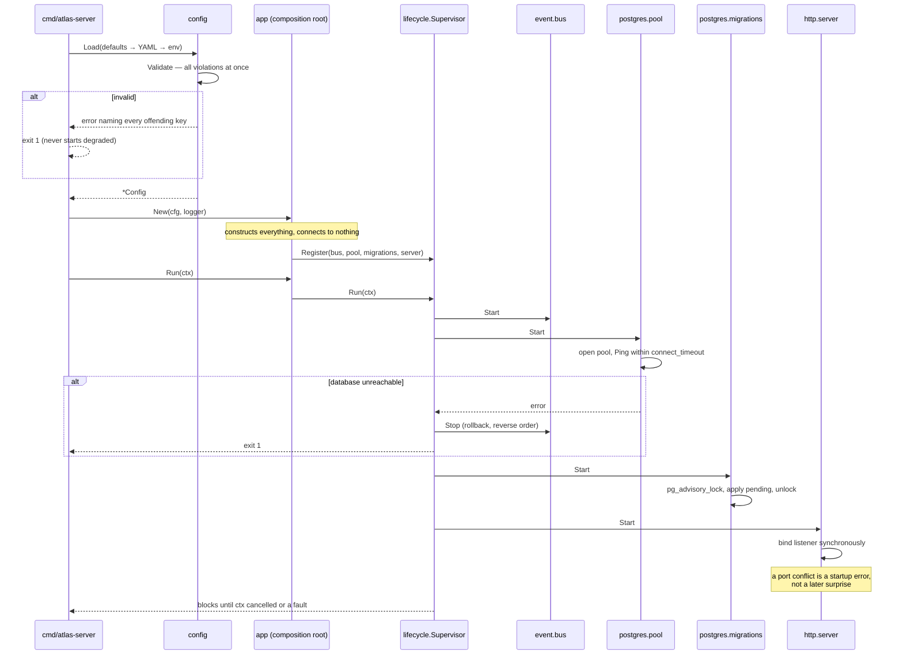
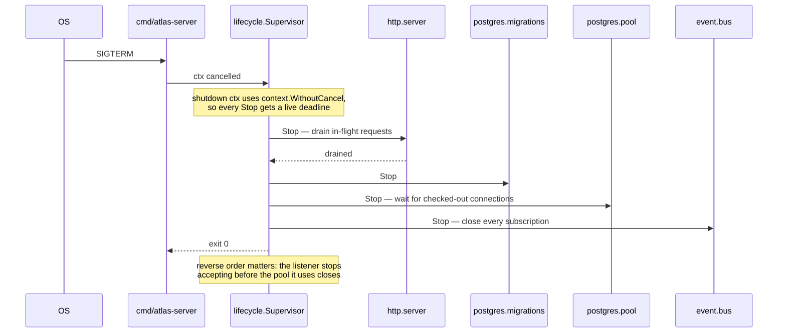
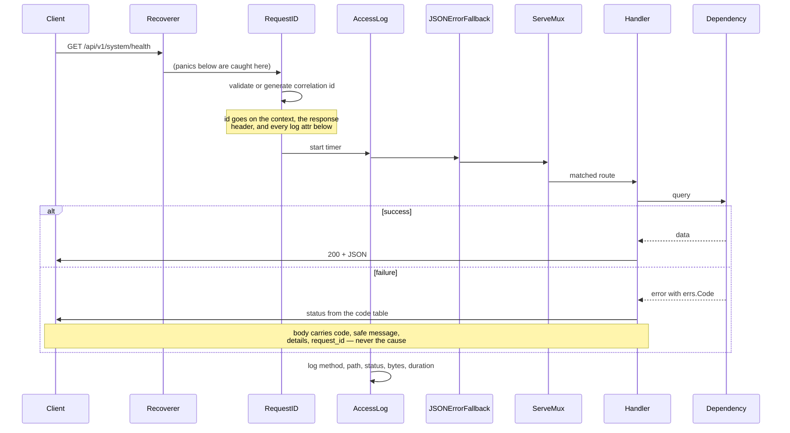
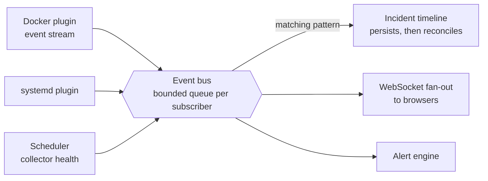
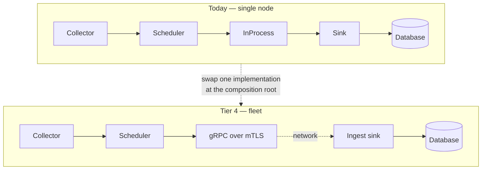

# Data Flow and Sequence Diagrams

The paths that matter, in the order a reader is likely to need them.

## Startup

Components start in registration order; a failure rolls back everything already
started, so the process never lingers half-initialised.



## Shutdown



Bounded by `server.shutdown_timeout`. A component still running when the budget
expires is abandoned and the shutdown is reported as unclean rather than
silently truncated.

## Serving a request



## Collection (Phase 1 onward)

```mermaid
sequenceDiagram
    participant S as Scheduler
    participant C as Collector
    participant T as Transport
    participant K as Sink
    participant DB as TimescaleDB
    participant B as Event bus

    loop every interval, jittered
        S->>S: acquire a concurrency slot
        S->>C: Collect(ctx with timeout)
        alt returns samples
            C-->>S: []Sample
            S->>S: validate; drop only invalid samples
            S->>T: Send(Envelope{Origin, Batch})
            T->>K: Receive
            K->>DB: bulk insert
            opt recovering from failure
                S->>B: publish collector.run.recovered
            end
        else error or timeout
            C-->>S: error
            S->>B: publish collector.run.failed
        else panic
            C-->>S: recovered by safeCollect
            S->>B: publish collector.run.panicked
            Note over S: other collectors are unaffected
        end
        S->>S: release the slot
    end
```

Four safety properties are enforced here, each because the opposite has taken
down a monitored host in some agent somewhere: bounded runs, non-overlapping
runs, a concurrency ceiling, and start jitter.

## Events



If a subscriber's queue is full the event is dropped **for that subscriber
alone**, counted, and a rate-limited warning is logged. Publishers never block.

The reason is the scenario where it matters: a browser tab holding a WebSocket
subscription on a laptop that goes to sleep. If publishing blocked, that
stalled client would back-pressure into the collector scheduler, delay metric
collection, and make Atlas report a healthy host as unresponsive — the
monitoring system becoming the outage. See
[ADR-0008](../adr/0008-lossy-event-bus.md).

Consumers that cannot lose events persist from a durable subscriber and
reconcile on restart. The bus says something changed; the database remains the
source of truth.

## The transport seam

The same collectors and the same storage, with a different distance between.



`Origin` — node id, hostname, agent version — is carried on every envelope
today, in single-node deployments where it is constant. That redundancy is
deliberate: the schema, query layer, and UI are multi-node from the first row
written, so Tier 4 adds agents with **no data migration**. See
[ADR-0005](../adr/0005-transport-seam.md).

## Migrations

```mermaid
sequenceDiagram
    participant A as Instance A
    participant B as Instance B
    participant PG as PostgreSQL

    par rolling deploy
        A->>PG: pg_advisory_lock(ATLAS)
        PG-->>A: acquired
    and
        B->>PG: pg_advisory_lock(ATLAS)
        Note over B,PG: blocks
    end

    A->>PG: create ledger if absent
    A->>PG: read applied migrations
    A->>A: verify checksums of applied files
    alt a file changed since it was applied
        A-->>A: fail startup — applied migrations are immutable
    end
    loop each pending migration
        A->>PG: BEGIN; migration SQL; INSERT ledger row; COMMIT
    end
    A->>PG: pg_advisory_unlock

    PG-->>B: acquired
    B->>PG: read applied migrations
    Note over B: nothing pending — clean no-op
    B->>PG: pg_advisory_unlock
```

The unlock runs on a context derived with `context.WithoutCancel`. If the run's
context was cancelled, an unlock on that context would fail and the lock would
linger until the connection was reaped — blocking every other instance in the
meantime.
