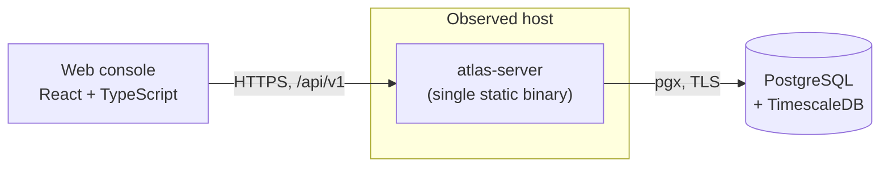
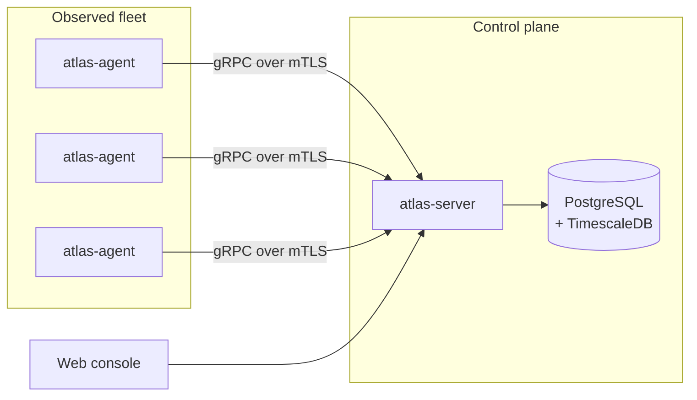
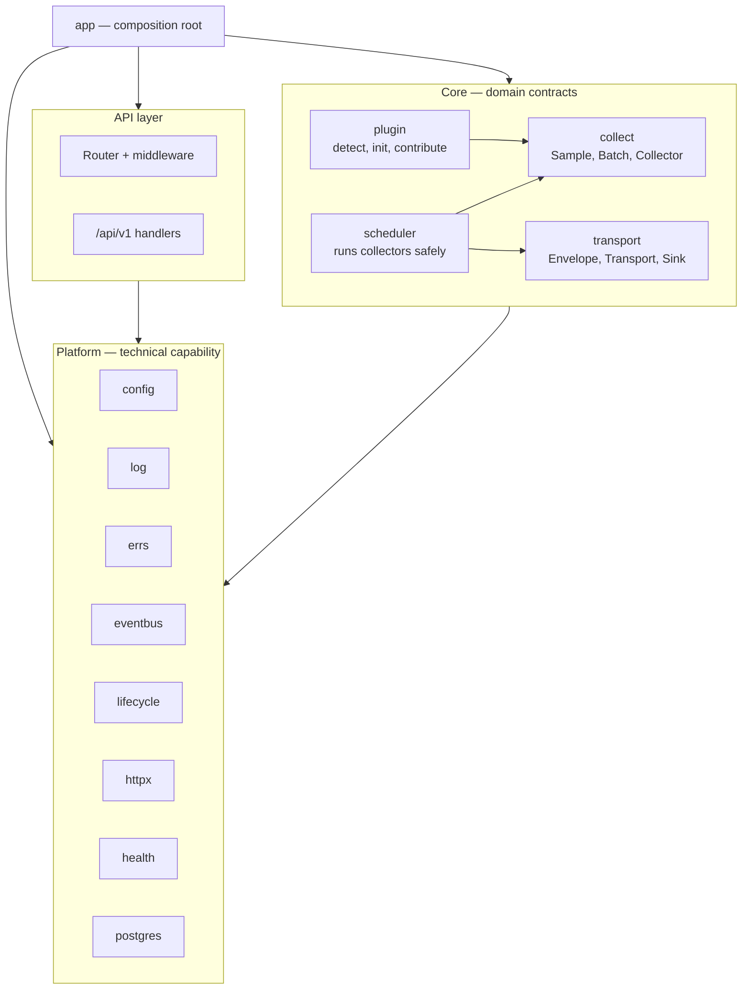
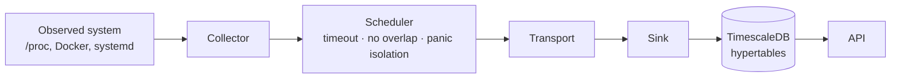
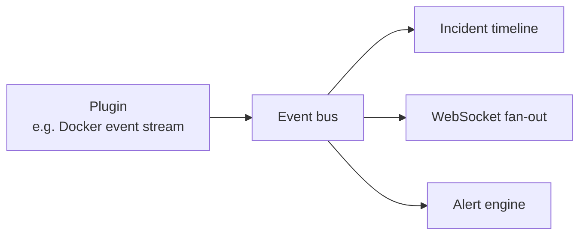

# System Architecture

## What Atlas is

Atlas observes infrastructure and presents it as one coherent picture. It
collects metrics and events from hosts, containers, services, and processes;
stores them as time series alongside relational context about who owns what;
and serves both through a versioned HTTP API to a web console.

## The one constraint everything else follows from

Atlas is **read-only**. It has no code path that modifies an observed system —
no container restarts, no service reloads, no configuration writes. This is not
a feature that was deferred; it is the property that makes Atlas safe to give
broad access to and safe to run on production hosts.

Two consequences run through the whole design:

- **The API exposes no write verb.** The router answers `POST`, `PUT`, `PATCH`,
  and `DELETE` with `405 method_not_allowed` before reaching any handler, and
  the frontend client offers no function that could issue one.
- **Atlas must never become a load source.** A monitoring system that degrades
  the host it watches converts a minor incident into a major one. The
  scheduler enforces per-run timeouts, non-overlapping runs, a concurrency
  ceiling, and start jitter; the event bus drops rather than blocks. Each of
  these is a decision to lose some observations rather than to slow down the
  observed system.

## Deployment shape today

Atlas ships as a single static binary plus a PostgreSQL/TimescaleDB database.

## Deployment shape at Tier 4

Multi-server monitoring replaces the in-process transport with a network one.
No collector and no repository changes.

The seam that makes this a swap rather than a rewrite is documented in
[ADR-0005](../adr/0005-transport-seam.md).

## Internal structure

The dependency rule is one-directional and absolute: **API and Core may depend
on Platform; Platform depends on nothing above it.** Nothing in `platform/`
imports `core/` or `api/`. This is what allows the entire technical foundation
to be tested without any domain concept present, and the domain contracts to be
tested without any infrastructure. See
[backend architecture](backend-architecture.md) for the package-by-package
detail.

## Components and their lifecycle

The composition root registers four components. They start in this order and
stop in exactly the reverse, enforced by the lifecycle supervisor:

| Order | Component | Responsibility | Why here |
| --- | --- | --- | --- |
| 1 | `event.bus` | In-process publish/subscribe | Holds no external resource; everything else may publish while starting |
| 2 | `postgres.pool` | Connection pool, verified reachable | A hard dependency; failure here aborts startup |
| 3 | `postgres.migrations` | Applies pending schema changes | Schema must be current before anything reads it |
| 4 | `http.server` | Binds the listener and serves | Last up, first down: Atlas accepts requests only once it can answer them, and drains before its dependencies close |

A component that fails to start rolls back everything already started. A
component that fails at runtime reports a fault, and the supervisor performs an
ordered shutdown rather than leaving a half-dead process.

## Data path

Alongside it, an event path carries state changes rather than measurements:

The two paths have deliberately different guarantees. Measurements are the
durable record and are delivered synchronously, with back-pressure. Events are
notifications and are delivered lossily, never blocking their publisher. The
reasoning is in [ADR-0008](../adr/0008-lossy-event-bus.md).

## Technology choices

| Concern | Choice | Recorded in |
| --- | --- | --- |
| Backend language | Go | [ADR-0001](../adr/0001-go-and-react-typescript.md) |
| Frontend | React 19 + TypeScript + Vite | [ADR-0001](../adr/0001-go-and-react-typescript.md) |
| Layering | Modular monolith, platform/core/api | [ADR-0002](../adr/0002-modular-monolith.md) |
| Datastore | PostgreSQL + TimescaleDB | [ADR-0003](../adr/0003-postgresql-timescaledb.md) |
| Dependency injection | Explicit constructor injection | [ADR-0004](../adr/0004-constructor-injection.md) |
| Collection topology | Transport seam | [ADR-0005](../adr/0005-transport-seam.md) |
| Extensibility | Compiled-in plugins | [ADR-0006](../adr/0006-compiled-in-plugins.md) |
| Schema evolution | Forward-only migrations | [ADR-0007](../adr/0007-forward-only-migrations.md) |
| Event delivery | Lossy, non-blocking bus | [ADR-0008](../adr/0008-lossy-event-bus.md) |
| Error handling | Typed error kernel with a redaction boundary | [ADR-0009](../adr/0009-typed-error-kernel.md) |
| API evolution | URL-path versioning | [ADR-0010](../adr/0010-url-path-api-versioning.md) |

## What is not built yet

Phase 0 established the foundation. The `collect`, `transport`, `scheduler`,
and `plugin` packages are complete and tested, but no collector or plugin
exists yet, so the scheduler is not composed into the running server. It is
wired in Phase 1 together with the first collectors and the metric storage
they write to. See the [phase plan](../roadmap/phases.md).
